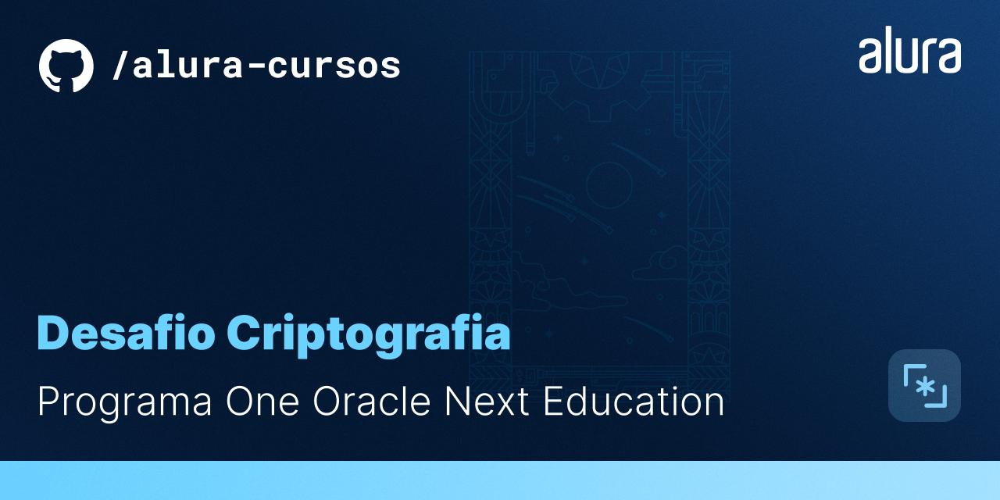
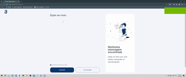

<!-- **Settings** > **Options** > **Social preview** > **Edit** > **Upload an image...** -->

<!--  -->
    

  
# Decodificador 

O desafio proposto neste projeto é trabalhar em uma aplicação que criptografa textos, assim você poderá trocar mensagens secretas com outras pessoas que saibam o segredo da criptografia utilizada. O desafio foi implementada utilizando Javascript, html e css.

## 🔨 Funcionalidades do projeto

<!-- Indique quais são as funcionalidades e comportamentos do App -->

Nesta aplicação, deve ser possível realizar a codificação de uma mensagem de acordo com a regra proposta no desafio, decodificá-la e também copiar a mensagem de saída após codificar/decodificar.

Abaixo segue um exemplo em formato de gif:

## ✔️ Técnicas e tecnologias utilizadas

**Faça uma lista de tecnologias e técnicas utilizadas (a justificativa e descrição são opcionais)**:

- `HTML`: A linguagem de marcação texto HTML tem um papel fundamental em criar a estrutura da nossa página web que o usuário irá visualizar os elementos adicionados e completando nossa aplicação junto com Javascript e CSS.
- `CSS`: Linguagem de estilização que utilizamos para darmos a nossa aplicação uma cara agradável de se visualizar. Fazendo com que a experiência do usuário seja boa. No CSS utilizamos:
  - `Flexbox`: Para controle do agrupamento de elementos e alinhamento entre nossos elementos dentro de uma divisão.
- `Javasript`: Com o Javascript implementamos o fluxo do click dos botões, a regra de codificação e decodificação, assim como providenciar a saída e copiar a saída para o clipboard do computador.

## 📁 Acesso ao projeto

Para visualizar o projeto basta clonar o repositório para o seu computador. 

> obs: Este projeto não tem elementos responsível. Portanto, foi feito com um monitor ultrawide de tamanho 2560x1080 e pode apresentar distorções para outros monitores.

## 🛠️ Abrir e rodar o projeto

Para abrir e rodar o projeto, utilize o Live Server (extenssão) no vscode e acesse o */index.html*.

## 📚 Mais informações do curso

O curso para conteúdo de estudos para implementação do Desafio foi oferecido pela parceiria entre **Oracle + Alura**. 
